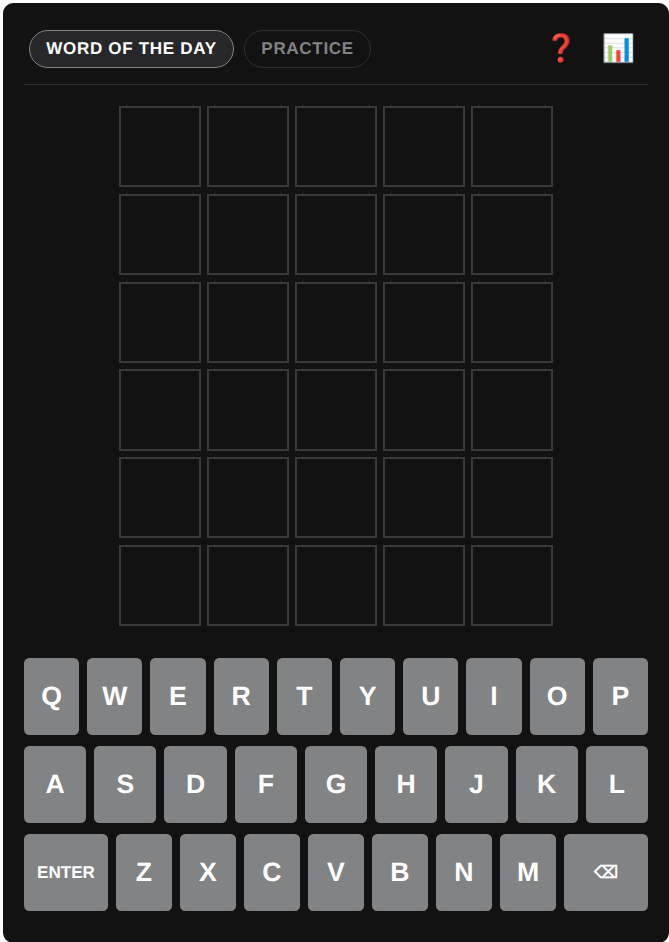

# WP Wordle

WP Wordle is a WordPress plugin that integrates a Wordle game directly into your website. Inspired by the New York Times design, it offers responsive gameplay, authentic animations, and server-side word validation.



## Features

- Daily Challenge: A shared secret word that automatically updates every 24 hours.
- Practice Mode: An infinite replayable mode with random words for endless training.
- Secure Validation: Guess evaluation is handled securely via the WordPress REST API to prevent client-side spoilers.
- Two Languages: Built-in dictionary support for both English and Italian.
- Authentic Animations: Two-phase 3D letter flip transitions, shake effects on invalid guesses, and win bounce animations.
- Statistics and Sharing: Tracks player games, win percentage, and streaks, with clipboard result sharing.
- Admin Settings: Manage defaults and set manual daily word overrides directly from the WordPress dashboard.

## Installation

1. Place the `wp-wordle` plugin folder inside `/wp-content/plugins/`.
2. Navigate to **Plugins** > **Installed Plugins** in your WordPress dashboard.
3. Locate **WP Wordle Game** and click **Activate**.

## How to Add the Game to Your Site

Insert the shortcode into any page, post, or block:

```text
[wp_wordle]
```

### Shortcode Attributes

Customize language or game mode using optional attributes:

- English vocabulary:
  ```text
  [wp_wordle lang="en"]
  ```

- Italian vocabulary:
  ```text
  [wp_wordle lang="it"]
  ```

- Start in Practice mode:
  ```text
  [wp_wordle mode="practice"]
  ```

## Configuration

Go to **Settings** > **WP Wordle** in the admin dashboard to:
- Choose the default game language.
- View vocabulary size and inspect the active daily word.
- Override the daily word manually for promotions or custom events.

